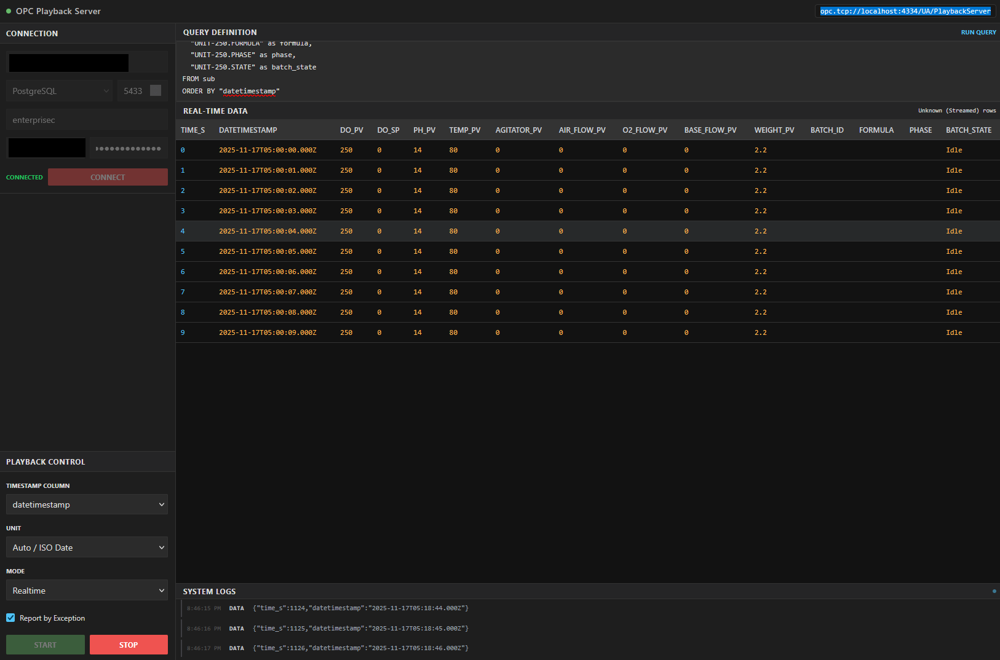

# DB-OPC Playback

**DB-OPC Playback** is a tool that allows you to "replay" historical data from a SQL database (PostgreSQL, MySQL, or SQL Server) as live **OPC UA** tags. It acts as a bridge, simulating a real-time device by publishing database rows one by one, respecting the original time differences between records.



---

## 📋 Prerequisites

Before you begin, ensure you have the following installed on your machine:

1.  **Node.js (Required)**
    *   This application runs on the Node.js runtime.
    *   **Action:** Download and install the **LTS version** (Long Term Support) from the official website: [https://nodejs.org/](https://nodejs.org/).
    *   **Verify:** Open your terminal (Command Prompt or PowerShell on Windows) and type `node -v`. You should see a version number (e.g., `v18.x.x` or `v20.x.x`).

2.  **A Database**
    *   You need access to a running database instance (PostgreSQL, MySQL, or Microsoft SQL Server) that contains the data you wish to replay.

---

## 🚀 Installation Guide

Follow these steps to get the application running on your computer.

### 1. Download the Project
*   **Option A (Git):** If you are familiar with Git, open your terminal and run:
    ```bash
    git clone https://github.com/djbrandl/db-opc-playback.git
    cd db-opc-playback
    ```
*   **Option B (ZIP):** 
    1.  Download the ZIP file of this project.
    2.  Extract (Unzip) the folder to a location on your computer (e.g., `C:\Users\You\Documents\db-opc-playback`).
    3.  Open the folder.

### 2. Install Dependencies
This project relies on several external libraries (like `node-opcua` and database drivers). You need to install them once.

1.  Open your terminal inside the project folder.
    *   *Tip: On Windows, open the folder, click the address bar at the top, type `cmd`, and hit Enter.*
2.  Run the following command:
    ```bash
    npm install
    ```
3.  Wait for the process to finish. You should see a message indicating packages were added.

### 3. Configuration (Optional)
The application uses default ports: **3000** for the Website and **4334** for the OPC UA Server. If you need to change these:
1.  Find the file named `.env`.
2.  Open it with any text editor (Notepad, VS Code).
3.  Change the numbers after `PORT=` or `OPC_PORT=`.
4.  Save the file.

---

## ▶️ How to Run

Every time you want to use the tool, follow these simple steps:

1.  **Start the Server**
    In your terminal (inside the project folder), type:
    ```bash
    node server.js
    ```

2.  **Verify Startup**
    Look for the following output in your terminal window:
    ```
    OPC UA Server initialized on port 4334
    Server running on http://localhost:3000
    ```
    *Keep this terminal window open. Closing it will stop the server.*

---

## 📖 User Guide

### Step 1: Open the Dashboard
Open your web browser (Chrome, Edge, Firefox, etc.) and go to:
[http://localhost:3000](http://localhost:3000)

### Step 2: Connect to Your Database
1.  Look at the **Connection** panel in the left sidebar.
2.  Select your **Database Type** (e.g., `PostgreSQL`).
3.  Enter the **Host** (usually `localhost`), **Port**, **Database Name**, **Username**, and **Password**.
4.  Click the **CONNECT** button.
    *   *If successful, the status text will turn GREEN and say "CONNECTED".*

### Step 3: Define Your Query
1.  In the top "Query Definition" box, type the SQL query to retrieve your data.
2.  **IMPORTANT:** You must include an `ORDER BY` clause (e.g., ordering by time) so the playback happens in the correct sequence.
    *   *Example:* `SELECT * FROM factory_logs ORDER BY log_time ASC`
3.  Click **RUN QUERY**.
    *   *The "Real-Time Data" table will load a preview of the first 10 rows.*

### Step 4: Configure Playback
In the left sidebar "Playback Control" panel:

1.  **Timestamp Column:** Select the column from your query that represents time.
2.  **Unit:** Tell the system how to interpret that timestamp:
    *   *Auto / ISO Date:* Use this for standard date/time text (e.g., `2023-01-01 10:00:00`).
    *   *Seconds / Milliseconds:* Use this if your timestamp is just a number (e.g., `168000`).
3.  **Mode:**
    *   *Realtime:* Replays data respecting the exact time gap between rows.
    *   *Multiplier:* Like Realtime, but faster (e.g., 2x speed) or slower (0.5x speed).
    *   *Fixed Interval:* Ignores the timestamps and just sends a new row every X milliseconds.
4.  **Report by Exception:** Keep this **Checked** to reduce noise. It ensures tags only update if the value has actually changed.

### Step 5: Start Playback & Connect OPC Client
1.  Click the green **START** button.
2.  Open your OPC UA Client software (e.g., UAExpert, Ignition, Kepware).
3.  Connect to the Endpoint URL displayed in the dashboard header:
    `opc.tcp://localhost:4334/UA/PlaybackServer`
4.  Browse to `Root` -> `Objects` -> `PlaybackDevice`.
    *   You will see tags created for every column in your SQL query.
    *   Watch them update in real-time as the playback runs!

---

## 🛠️ Companion Tools

To quickly verify and visualize your playback data, we recommend using the **[Plain OPC UA Client](https://github.com/djbrandl/plain-opc-client)**. 

It is a lightweight, no-frills client designed specifically as an ease-of-setup validation tool for the data exposed by this repository.

---

## ❓ Troubleshooting

*   **"SASL: SCRAM-SERVER-FIRST-MESSAGE..." Error:**
    *   This usually means your database password is incorrect or authentication failed. Double-check your credentials.
*   **"Error: connect ECONNREFUSED..."**:
    *   The application cannot reach your database. Ensure your database server is running and the Host/Port are correct.
*   **I don't see any tags in my OPC Client:**
    *   Make sure you clicked **Start** on the dashboard. The tags are generated dynamically based on the data.
