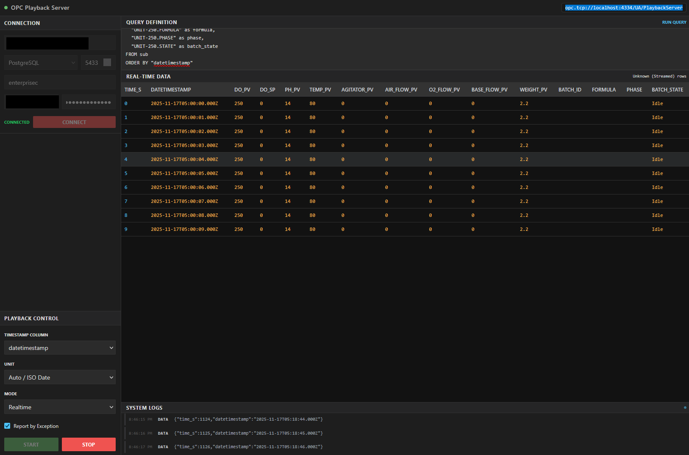

# DB-OPC Playback

**DB-OPC Playback** is a tool that replays historical data from a SQL database (PostgreSQL, MySQL, or SQL Server) as live **OPC UA** tags and **MQTT/SparkplugB** messages simultaneously. It acts as a bridge, simulating a real-time device by publishing database rows one by one, respecting the original time differences between records.

Both protocol outputs run in parallel during playback -- the same data is published to OPC UA, SparkplugB (protobuf-encoded), and plain MQTT (human-readable) at the same time.



---

## Prerequisites

Before you begin, ensure you have the following installed on your machine:

1.  **Node.js (Required)**
    *   Download and install the **LTS version** from the official website: [https://nodejs.org/](https://nodejs.org/).
    *   **Verify:** Open your terminal and type `node -v`. You should see a version number (e.g., `v18.x.x` or newer).

2.  **A Database**
    *   You need access to a running database instance (PostgreSQL, MySQL, or Microsoft SQL Server) that contains the data you wish to replay.

---

## Installation

### 1. Download the Project
*   **Option A (Git):**
    ```bash
    git clone https://github.com/djbrandl/db-opc-playback.git
    cd db-opc-playback
    ```
*   **Option B (ZIP):**
    1.  Download the ZIP file of this project.
    2.  Extract the folder to a location on your computer.
    3.  Open the folder.

### 2. Install Dependencies

Open your terminal inside the project folder and run:

```bash
npm install
```

### 3. Configuration (Optional)

The application uses these default ports:

| Service | Default Port | `.env` Variable |
|---------|-------------|-----------------|
| Web Dashboard | 3000 | `PORT` |
| OPC UA Server | 4334 | `OPC_PORT` |
| MQTT Broker | 1883 | `MQTT_PORT` |

To change any port, open the `.env` file in a text editor and update the values:

```env
PORT=3000
OPC_PORT=4334
MQTT_PORT=1883
```

---

## How to Run

1.  **Start the Server**

    ```bash
    node server.js
    ```

2.  **Verify Startup**

    You should see output similar to:
    ```
    OPC UA Server initialized on port 4334
    MQTT Broker listening on port 1883
    Server running on http://localhost:3000
    ```

    The web dashboard will open automatically in your default browser. Keep the terminal window open -- closing it stops all servers.

---

## User Guide

### Step 1: Open the Dashboard

Open your web browser and go to [http://localhost:3000](http://localhost:3000).

The header bar shows both protocol endpoints:
- **OPC UA:** `opc.tcp://localhost:4334/UA/PlaybackServer`
- **MQTT:** `mqtt://localhost:1883`

### Step 2: Connect to Your Database

1.  In the **Connection** panel (left sidebar), select your **Database Type** (PostgreSQL, MySQL, or MSSQL).
2.  Enter the **Host**, **Port**, **Database Name**, **Username**, and **Password**.
3.  Click **Connect**.
    *   A green "CONNECTED" status confirms a successful connection.

### Step 3: Define Your Query

1.  In the **Query Definition** panel, type the SQL query to retrieve your data.
2.  **Important:** Include an `ORDER BY` clause so playback happens in the correct sequence.
    *   Example: `SELECT * FROM factory_logs ORDER BY log_time ASC`
3.  Click **Run Query**.
    *   The "Real-Time Data" table loads a preview of the first 10 rows.

### Step 4: Configure Playback

In the **Playback Control** panel (left sidebar):

1.  **Timestamp Column:** Select the column that represents time.
2.  **Unit:** How to interpret the timestamp:
    *   *Auto / ISO Date:* Standard date/time text (e.g., `2023-01-01 10:00:00`).
    *   *Seconds / Milliseconds:* Numeric timestamps (e.g., `168000`).
3.  **Mode:**
    *   *Realtime:* Respects the exact time gap between rows.
    *   *Multiplier:* Faster (e.g., 2x) or slower (0.5x) than real-time.
    *   *Fixed Interval:* Sends a row every X milliseconds regardless of timestamps.
4.  **Report by Exception (RBE):** When checked, tags and MQTT messages only update when values actually change. Reduces noise for both OPC UA and MQTT consumers.

### Step 5: Configure Protocol Output

Below the playback settings, use the **protocol tabs** to configure output:

#### OPC UA Tab

OPC UA is always active. Tags are automatically created from your query columns. No additional configuration is needed.

#### MQTT / SparkplugB Tab

Configure the MQTT output:

| Field | Default | Description |
|-------|---------|-------------|
| **Group ID** | `Playback` | SparkplugB group identifier |
| **Edge Node ID** | `PlaybackNode` | SparkplugB edge node identifier |
| **Device ID** | `PlaybackDevice` | SparkplugB device identifier |
| **Publish SparkplugB** | Checked | Enables protobuf-encoded SparkplugB messages |
| **Publish Plain MQTT** | Checked | Enables human-readable per-column MQTT messages |
| **Plain MQTT Base Topic** | *(empty)* | Custom base topic override (see below) |

### Step 6: Start Playback

1.  Click the green **Start** button.
2.  The system begins streaming data from your database through all enabled outputs simultaneously.

---

## Connecting Clients

### OPC UA

1.  Open any OPC UA client (UAExpert, Ignition, Kepware, etc.).
2.  Connect to: `opc.tcp://localhost:4334/UA/PlaybackServer`
3.  Browse to `Root` > `Objects` > `PlaybackDevice`.
4.  You will see tags for every column in your SQL query, updating in real-time.

### MQTT / SparkplugB

Connect any MQTT client (MQTT Explorer, mosquitto_sub, Ignition MQTT Engine, etc.) to `mqtt://localhost:1883`.

#### SparkplugB Topics

The embedded broker publishes standard SparkplugB v1.0 messages:

| Message | Topic | When |
|---------|-------|------|
| **NBIRTH** | `spBv1.0/{groupId}/NBIRTH/{edgeNodeId}` | Once at playback start |
| **DDATA** | `spBv1.0/{groupId}/DDATA/{edgeNodeId}/{deviceId}` | On each data row |

To subscribe to all SparkplugB traffic:
```
spBv1.0/#
```

Payloads are protobuf-encoded per the SparkplugB specification. SparkplugB-aware clients (Ignition MQTT Engine, Sparkplug-compatible SCADA systems) will automatically decode the metric names, types, and values.

**Metric type mapping:**

| JavaScript Type | SparkplugB Type |
|----------------|-----------------|
| `number` | `Double` |
| `boolean` | `Boolean` |
| `Date` | `DateTime` |
| Everything else | `String` |

#### Plain MQTT Topics

When plain MQTT is enabled, each column value is published as a UTF-8 string to an individual topic:

**Default topic structure:**
```
{groupId}/{edgeNodeId}/{deviceId}/{columnName}
```

For example, with default settings and a column named `temperature`:
```
Playback/PlaybackNode/PlaybackDevice/temperature
```

**Custom base topic:** If you enter a value in the "Plain MQTT Base Topic" field (e.g., `site1/building2`), topics become:
```
site1/building2/{columnName}
```

To subscribe to all plain MQTT data with defaults:
```
Playback/PlaybackNode/PlaybackDevice/#
```

#### Quick Test with mosquitto_sub

```bash
# Subscribe to all SparkplugB messages
mosquitto_sub -h localhost -p 1883 -t "spBv1.0/#" -v

# Subscribe to all plain MQTT messages (default topics)
mosquitto_sub -h localhost -p 1883 -t "Playback/PlaybackNode/PlaybackDevice/#" -v
```

---

## Architecture

```
DB Stream -> playbackEngine -> row event
                                |-> opcManager.updateTags()       -> OPC UA clients
                                |-> mqttManager.updateMetrics()
                                |    |-> SparkplugB DDATA         -> SparkplugB clients
                                |    |-> Plain MQTT per-column    -> MQTT clients
                                |-> Socket.IO                     -> Web dashboard
```

The playback engine is protocol-agnostic. It streams rows from the database and emits events. Each protocol manager independently handles its own publishing, RBE filtering, and client connections.

---

## Companion Tools

To quickly verify and visualize your OPC UA playback data, we recommend the **[Plain OPC UA Client](https://github.com/djbrandl/plain-opc-client)** -- a lightweight validation tool designed for this repository.

For MQTT verification, [MQTT Explorer](https://mqtt-explorer.com/) provides an excellent visual client that can connect to the embedded broker and display both plain MQTT and SparkplugB messages.

---

## Troubleshooting

*   **"SASL: SCRAM-SERVER-FIRST-MESSAGE..." Error:**
    *   Database password is incorrect or authentication failed. Double-check your credentials.
*   **"Error: connect ECONNREFUSED...":**
    *   The application cannot reach your database. Ensure the database server is running and the host/port are correct.
*   **No tags visible in OPC UA client:**
    *   Make sure you clicked **Start** on the dashboard. Tags are created dynamically when playback begins.
*   **"MQTT Broker error: listen EADDRINUSE":**
    *   Port 1883 is already in use by another process (e.g., Mosquitto). Change `MQTT_PORT` in `.env` to a different port.
*   **No MQTT messages appearing:**
    *   Verify your MQTT client is connected to the correct port. Check that "Publish SparkplugB" and/or "Publish Plain MQTT" checkboxes are enabled in the MQTT tab before starting playback.
*   **SparkplugB messages appear garbled:**
    *   SparkplugB payloads are protobuf-encoded, not plain text. Use a SparkplugB-aware client or decoder. Plain MQTT messages are published separately as readable UTF-8 strings.
